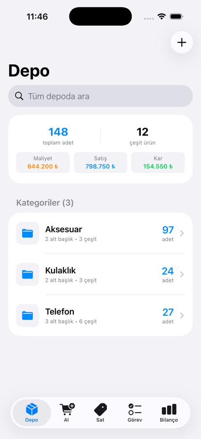
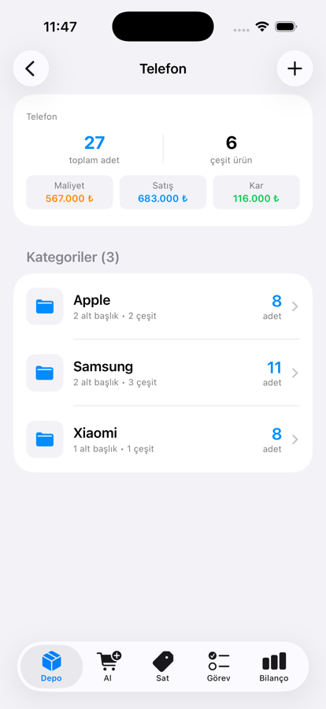
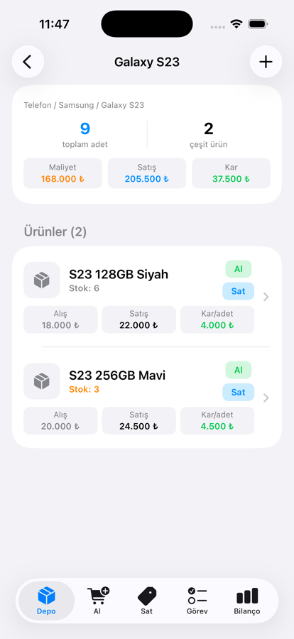
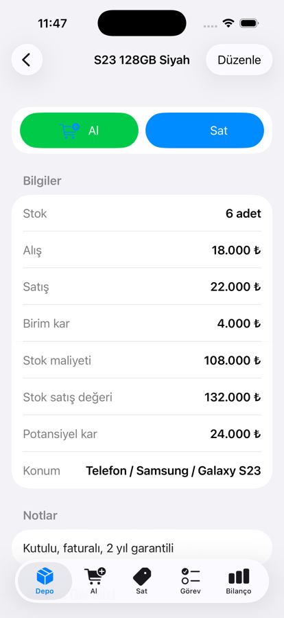
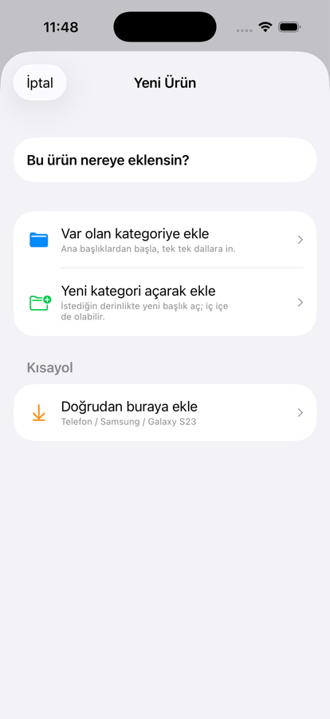
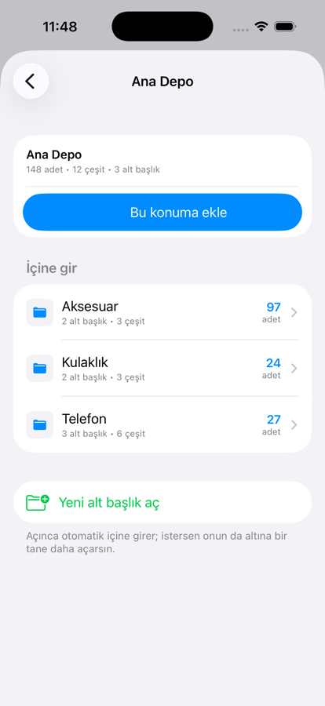
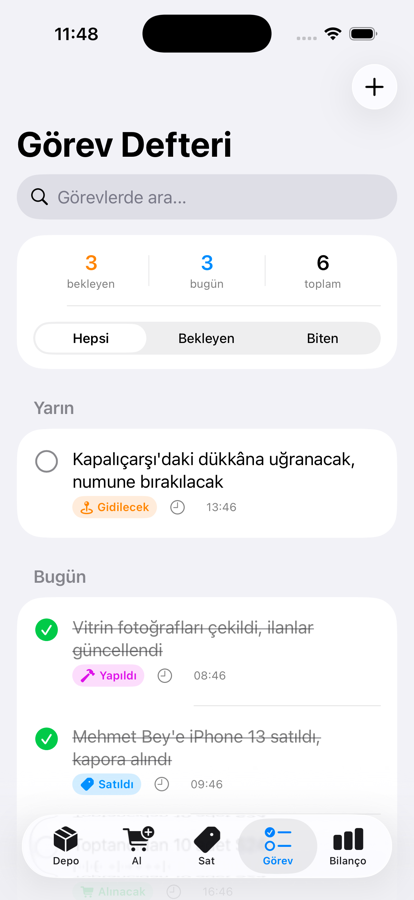
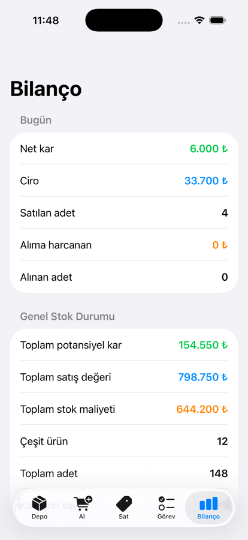

# İş Takip

iOS için depo (stok) ve iş/görev takip uygulaması. SwiftUI ile yazıldı, veriyi
tamamen cihazda tutar; sunucu ya da hesap gerektirmez.

> Xcode projesi, hedef (target) ve paket kimliği tarihsel sebeple hâlâ `Afelay`
> adını taşır. Bunlar bilerek değiştirilmedi: paket kimliği değişirse iOS
> uygulamayı bambaşka bir uygulama sayar ve cihazdaki mevcut veri erişilemez
> hale gelir. Kullanıcının gördüğü ad `İş Takip`'tir.

## Ekran Görüntüleri

<table>
<tr>
<td width="33%"><br><sub><b>Depo</b> — her dalın toplam adedi ve çeşidi</sub></td>
<td width="33%"><br><sub><b>Dallanma</b> — Telefon altındaki markalar</sub></td>
<td width="33%"><br><sub><b>Ürünler</b> — üç seviye aşağıda, alış/satış/kar</sub></td>
</tr>
<tr>
<td><br><sub><b>Ürün detayı</b> — stok, kar ve konum</sub></td>
<td><br><sub><b>Ürün ekleme</b> — var olan mı, yeni kategori mi</sub></td>
<td><br><sub><b>Konum seçici</b> — dallara in ya da yeni başlık aç</sub></td>
</tr>
<tr>
<td><br><sub><b>Görev defteri</b> — gün gün, tarih-saatli</sub></td>
<td><br><sub><b>Bilanço</b> — günlük kar ve genel stok</sub></td>
<td></td>
</tr>
</table>

<sub>Görüntülerdeki veriler örnektir, gerçek kayıt değildir.</sub>

## Ne yapar

**Depo** — Ürünleri istenildiği kadar dallanan kategorilerde tutar
(ör. `Telefon / Samsung / S23`). Her seviyede o dalın toplam adedi ve kaç çeşit
ürün olduğu görünür. Dal içinde veya tüm depoda arama yapılabilir. Ürünlere ve
kategorilere fotoğraf ve not eklenebilir.

**Ürün ekleme** — Konum adım adım seçilir: var olan kategoriye mi eklenecek,
yoksa yeni bir başlık mı açılacak. İstenilen derinlikte, iç içe yeni kategori
açılabilir.

**Al / Sat** — Hızlı alış ve satış kaydı. Her hareket kimden/kime bilgisiyle
birlikte geçmişe düşer, stok otomatik güncellenir. Hareket silinirse stok da
geri alınır.

**Görev Defteri** — Tarih ve saatiyle günlük tarzı kayıtlar: "alınacak/alındı",
"gidilecek/gidildi", "yapılacak/yapıldı". Gün gün gruplanır, süzülebilir.

**Bilanço** — Günlük kar/ciro, genel stok durumu, son hareketler. Ayrıca yedek
alma/paylaşma ve yedekten yükleme (birleştirerek veya üzerine yazarak).

## Veri

Veriler `Application Support/AfelayVeri/` altında JSON dosyalarında tutulur:
`kategoriler.json`, `urunler.json`, `islemler.json`, `gorevler.json`.
Fotoğraflar JSON'un içinde değil, `Resimler/` klasöründe ayrı dosyalarda durur;
her görselin bir de küçük (liste için) sürümü üretilir. Diske yazma arka planda
ve geciktirmeli yapılır.

Uygulamanın eski sürümlerinden kalan `UserDefaults` verisi ilk açılışta otomatik
olarak bu yapıya taşınır; taşımadan önce ham verinin yedeği `yedek_*.json`
olarak saklanır.

## Kaynak düzeni

| Dosya | İçerik |
|---|---|
| `Modeller.swift` | Kategori, Ürün, İşlem, Görev modelleri |
| `Depolama.swift` | Dosya tabanlı kalıcılık, resim deposu, önbellek, göç |
| `DepoVM.swift` | Tüm veri ve ağaç toplamlarının indekslenmesi |
| `DepoEkrani.swift` | Depo sekmesi (kategori gezgini) |
| `KonumSecici.swift` | Adım adım kategori seçme akışı |
| `UrunEkranlari.swift` | Ürün detayı ve ürün/kategori formları |
| `IslemEkranlari.swift` | Al / Sat sekmeleri |
| `GorevEkrani.swift` | Görev defteri |
| `BilancoEkrani.swift` | Bilanço |
| `Aktarim.swift` | Yedek alma / paylaşma / yükleme |
| `Ortak.swift` | Biçimlendirme ve ortak görünümler |

## Derleme

Xcode 26+ ve iOS 26.2+ gerekir.

```bash
xcodebuild -project Afelay.xcodeproj -scheme Afelay -configuration Release \
  -destination 'id=<CIHAZ_UDID>' -allowProvisioningUpdates build
```

Cihaza kurmak için:

```bash
xcrun devicectl device install app --device <CIHAZ_UDID> <yol>/Afelay.app
```

> Ücretsiz Apple geliştirici hesabıyla imzalanan derlemeler 7 gün sonra açılmaz
> ve yeniden kurulması gerekir.
